# FixIt — React Native Mobile Application

FixIt is a cross-platform mobile application built with **React Native**, **Expo SDK 57**, and **TypeScript**, connecting homeowners with verified local home-service professionals (plumbers, electricians, cleaners, painters, carpenters, gardeners) for scheduled appointments or urgent 30-minute callouts.

The application features full **Firebase Authentication**, **Firestore cloud persistence**, native iOS **Liquid Glass** UI styling, native 60/120fps navigation transitions, and **Reanimated** fluid cascading animations.

- **Final Project Presentation (PDF):** [FixIt Final Project Presentation (PDF)](docs/presentation.pdf)
- **Figma Design & Interactive Prototype:** [Shepeta_cross_assignments on Figma](https://www.figma.com/design/MJK386ryDWY8bcejg00axx/Shepeta_cross_assignments)

---

## 1. Initial Application Analysis & Improvement Strategy

### Baseline Capabilities (What Worked in Initial Version)
- **UI Scaffolding & Component Templates:** Initial screens (Home, Categories, Pro Profile) rendered basic layouts with responsive width detection (`useResponsiveLayout`) and baseline theme tokens (`colors.ts`, `spacing.ts`).
- **External Mock Data Feed:** Fetched demo provider profiles via seeded `randomuser.me` requests to populate professional headshots, names, and ratings without hardcoding static mock arrays.
- **Fundamental Navigation Structure:** Established a bottom tabs and drawer navigation layout with parameter passing to detail screens.

### Identified Bottlenecks & Architectural Limitations
1. **Lack of User Authentication & Ephemeral Session State:** The baseline app had no account system or registration flow. User activity, bookings, and customer preferences were kept only in volatile memory and wiped upon app reload. There was no user isolation, security, or persistent identity.
2. **Static & Non-Interactive Scheduling:** The booking flow was primitive and lacked calendar visualization. Users could not view an entire month of appointments, could not see busy/booked dates at a glance with indicators, and had no ability to modify, reschedule, or cancel active appointments.
3. **Absence of Direct Client-Provider Communication & Personalization:** Homeowners could not communicate with hired professionals to coordinate arrival, ask questions, or confirm quotes. Furthermore, there was no way to bookmark favorite professionals or filter urgent requests by trusted contractors.
4. **Platform Visual & Transition Deficits:** Screen transitions lacked iOS-native 60/120fps fluidity, drawer gestures collided with edge swipe-back navigation, tab bars flickered on tab switches, and text input fields lacked vertical centering and consistent Liquid Glass styling.

### Key Improvement Vectors Defined & Implemented
1. **Vector 1: Cloud-Native Backend & Secure Authentication (Firebase & Firestore)**
   - Integrated Firebase Authentication (`createUserWithEmailAndPassword`, `signInWithEmailAndPassword`, `signOut`).
   - Secure session management backed by hardware-level encrypted storage via `expo-secure-store` (iOS Keychain / Android Keystore) with sanitized alphanumeric keys.
   - Real-time Firestore document synchronizations for appointments (`bookings`), 1:1 direct messaging threads (`conversations` and `messages`), and curated contractor bookmarks (`favorites`).
2. **Vector 2: Full-Featured Monthly Calendar & Dynamic Scheduling Engine**
   - Designed and built an interactive monthly calendar (`MonthCalendar`) with active booking dot indicators, seamless month-to-month transitions, and day-specific appointment filtering.
   - Implemented an availability picker modal (`AvailabilityCalendar`) enabling users to reschedule existing bookings with automated capacity checks (per-pro booking limits).
3. **Vector 3: Native iOS Liquid Glass Aesthetics, 60/120fps Transitions & Fluid Micro-Interactions**
   - Adopted native iOS 26+ Liquid Glass (`GlassSurface` / `expo-glass-effect`) with consistent 48px heights, rounded radii, and subtle glass borders for all form inputs.
   - Implemented native stack screen transitions with interactive edge swipe-back gestures, eliminating navigation conflicts.
   - Introduced staggered entrance animations (`react-native-reanimated`) across Home, Profile, Pro details, and Help screens for an elevated, production-ready user experience.

---

## 2. State Management Architecture: Context API vs. Redux Toolkit

The application employs a deliberate, dual-tier state management architecture, separating low-frequency UI presentation preferences from high-frequency, asynchronous business domain data:

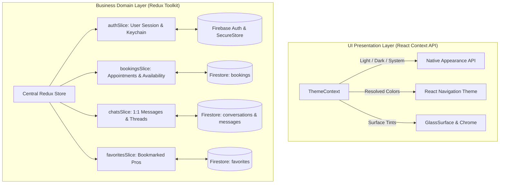

### Why React Context API for Theming (`ThemeContext.tsx`)
- **Low Mutation Frequency:** Theme preferences (`light`, `dark`, `system`) change very infrequently — exclusively upon manual user selection or system OS appearance mode changes. Context API is optimal for low-frequency global settings without introducing action/reducer boilerplate.
- **Direct Native & Navigation Integration:** React Navigation requires a theme object passed directly to the root `NavigationContainer`. `ThemeContext` directly synchronizes with native iOS Liquid Glass materials and invokes `Appearance.setColorScheme()` without needing dispatchers or intermediate middleware.
- **Clean Decoupling:** Keeps presentation concerns isolated from core business data, ensuring theme switches never trigger unnecessary business logic recalculations.

### Why Redux Toolkit for Authentication, Bookings, Chats & Favorites (`src/store/`)
- **Asynchronous Cloud Orchestration (`createAsyncThunk`):** Authentication with Firebase, Firestore realtime queries, network retries, and optimistic UI updates involve complex asynchronous lifecycles (`pending`, `fulfilled`, `rejected`). Redux Toolkit structures these workflows cleanly without cluttering UI components with side-effect logic.
- **Relational & Interdependent Domain State:**
  - `authSlice` manages user identity and SecureStore token persistence.
  - `bookingsSlice` tracks user appointments, calculates pro availability per date, and blocks overbooked slots (`MAX_BOOKINGS_PER_DAY = 3`).
  - `chatsSlice` manages real-time message streams, unread badges, and auto-responses.
  - `favoritesSlice` synchronizes bookmarked contractor IDs, directly filtering urgent callout candidates in `UrgentBookingScreen` and generating a dynamic "Favorites" category chip.
- **Selective Subscriptions & Re-render Isolation (`useAppSelector`):** Unlike Context API — where any state update re-renders all consuming components unless heavily optimized with memoization — Redux Toolkit's fine-grained selectors ensure that updating a single chat message or toggling a favorite pro only re-renders the specific list item or heart icon, preserving 60/120fps UI responsiveness.
- **Single Source of Truth & Predictable Debugging:** Centralized state transitions provide complete traceability and predictable recovery states if network operations fail.

---

## 3. Project Presentation & Design Artifacts

| Resource | Format | Description & Link |
| --- | --- | --- |
| **Final Project Presentation (PDF)** | **PDF (16:9 Deck)** | [Download / View FixIt Presentation PDF](docs/presentation.pdf) |
| **Figma UI/UX Design System** | **Figma** | [Figma Design File: Shepeta_cross_assignments](https://www.figma.com/design/MJK386ryDWY8bcejg00axx/Shepeta_cross_assignments) |
| **Presentation Deck Content** | **PDF / 9 Slides** | Complete slide deck covering project background, problem analysis, dual-tier architecture (Context API vs. Redux Toolkit), Firebase data models, and real iPhone 13 Pro screenshots. |

---

## 4. Screenshots

> [!NOTE]
> The screenshots below were captured on a physical iPhone 13 Pro device running iOS 27 with native Liquid Glass UI. All screenshots are rendered at a fixed width of 260px in a responsive grid.

### 1. Home, Categories & Pro Details

| Home                                                                | Categories                                                                      | Pro profile                                                                       |
| ------------------------------------------------------------------- | ------------------------------------------------------------------------------- | --------------------------------------------------------------------------------- |
|  |  |  |

**Landscape / tablet** (automatic reflow to a 2-column grid above 600dp):

| Home (tablet)                                                            | Categories (tablet)                                                                  | Pro profile (tablet)                                                                   |
| ------------------------------------------------------------------------ | ------------------------------------------------------------------------------------ | -------------------------------------------------------------------------------------- |
|  |  |  |

Home in landscape orientation:


---

### 2. Authentication & Profile

| Sign in                                                                | Create account                                                          | Profile screen                                                            | Gender selector modal                                                            |
| ---------------------------------------------------------------------- | ----------------------------------------------------------------------- | ------------------------------------------------------------------------- | -------------------------------------------------------------------------------- |
| 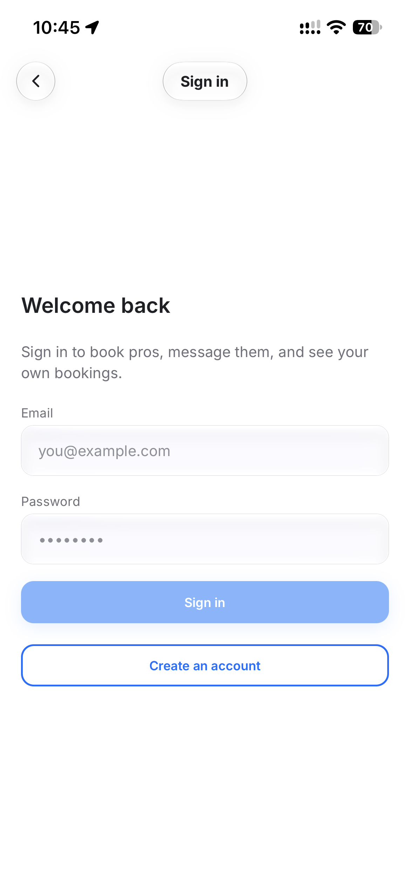 | 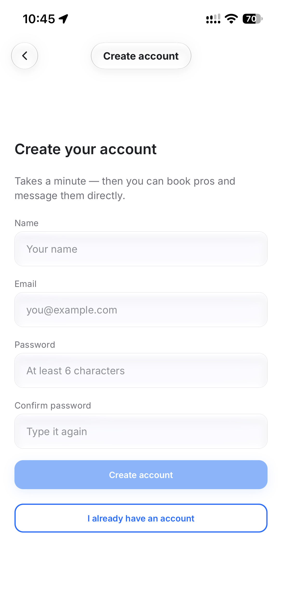 | 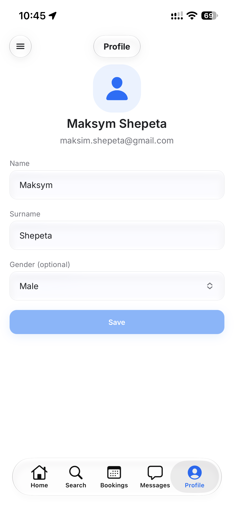 | 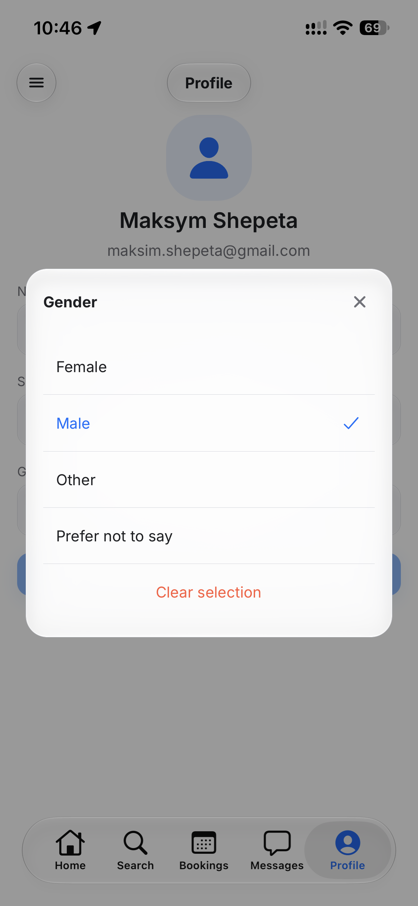 |

---

### 3. Bookings & Month Calendar

| Month Calendar & Upcoming Bookings                                                | Change Day Modal                                                                     |
| --------------------------------------------------------------------------------- | ------------------------------------------------------------------------------------ |
| 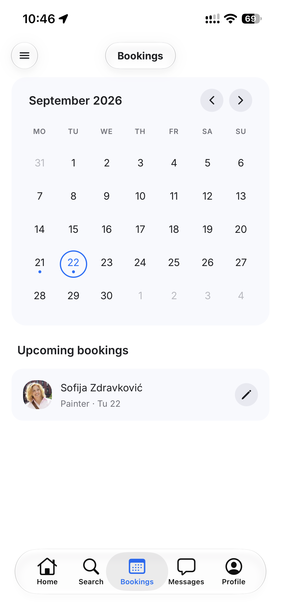 | 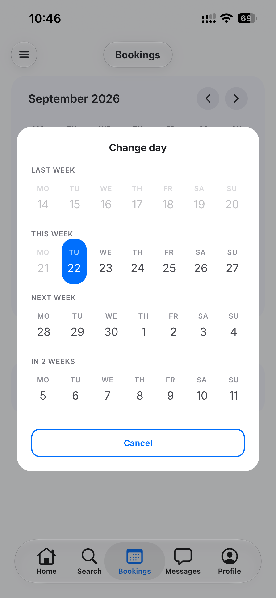 |

---

### 4. Direct Messaging & Chat

| Conversations list (Messages tab)                                              | Active Chat thread                                                            |
| ------------------------------------------------------------------------------ | ----------------------------------------------------------------------------- |
| 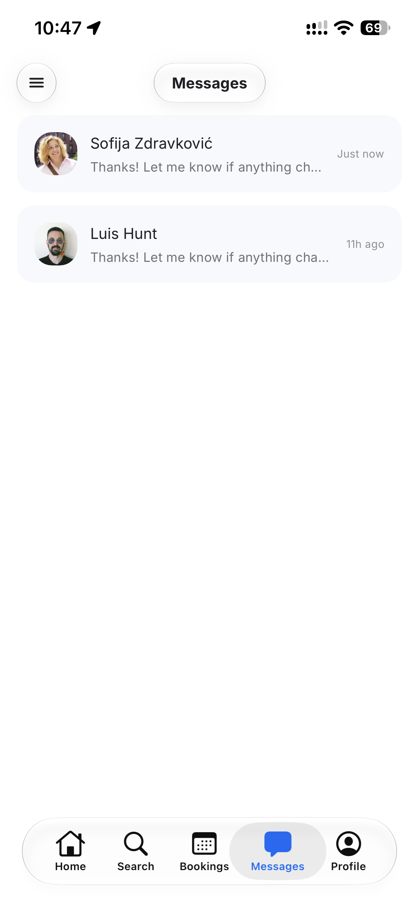 | 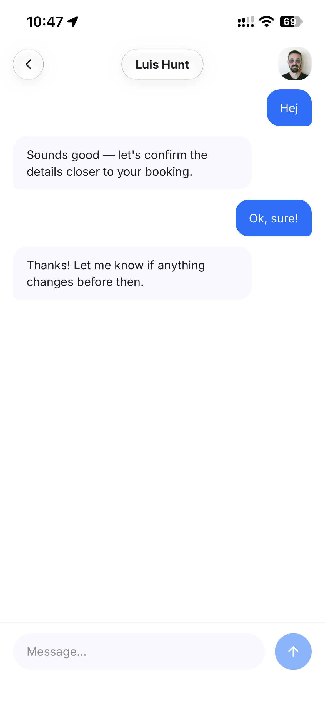 |

---

### 5. Favorites & Pro Details with Header Heart

| Pro Details with Heart in Header                                                    | Urgent Request with Favorites Filter                                                         |
| ----------------------------------------------------------------------------------- | -------------------------------------------------------------------------------------------- |
| 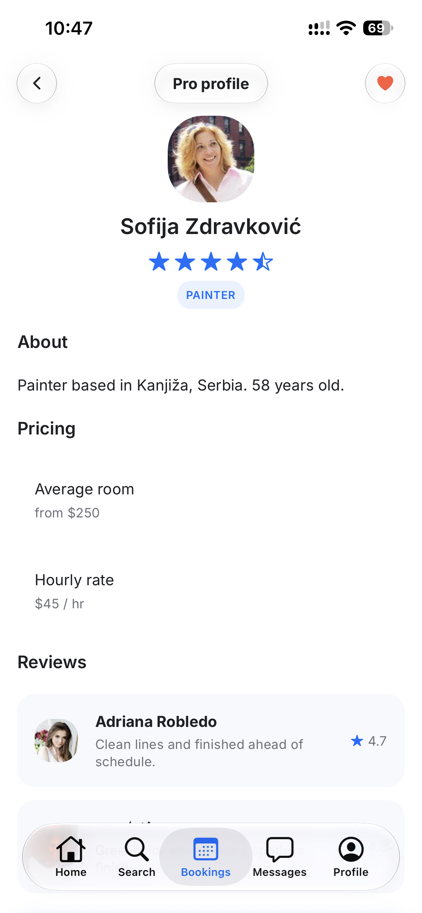 | 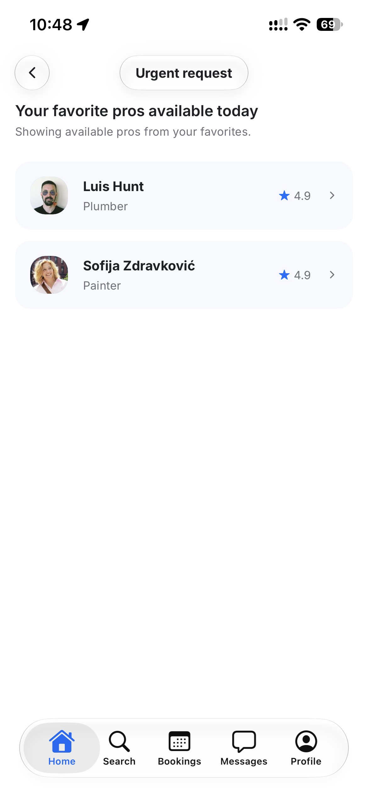 |

---

### 6. Navigation, Drawer & Theming

| Drawer open                                                                         | Help & Support                                                                      | Contact us                                                                                | Appearance (Theme)                                                                         |
| ----------------------------------------------------------------------------------- | ----------------------------------------------------------------------------------- | ----------------------------------------------------------------------------------------- | ------------------------------------------------------------------------------------------ |
|  |  |  | 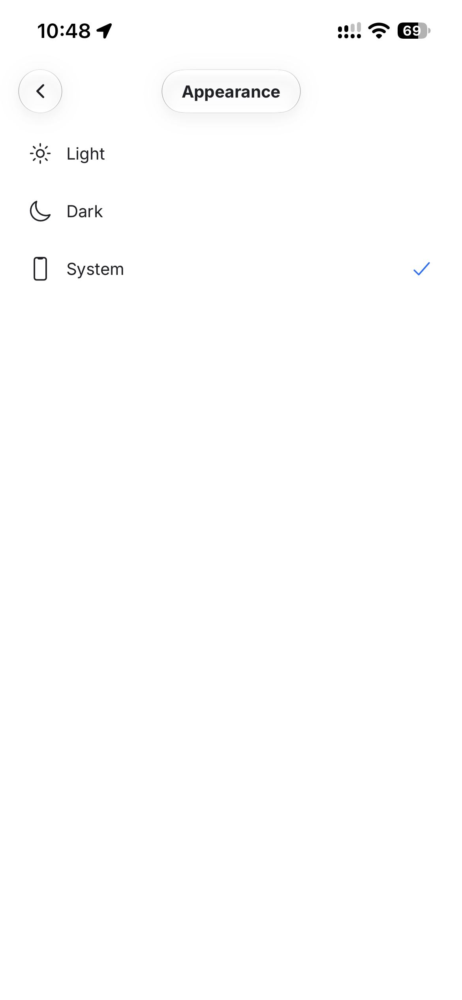 |

---

## 5. Core Features & Technical Implementation

### 1. Cloud Backend & Realtime Storage: Firebase & Firestore
- **Authentication (`src/api/auth.ts`, `src/store/authSlice.ts`):** Complete user authentication powered by Firebase Auth (`createUserWithEmailAndPassword`, `signInWithEmailAndPassword`, `signOut`).
- **Secure Session Storage:** Authentication tokens and user sessions are stored securely in native **`expo-secure-store`** (iOS Keychain / Android Keystore) using sanitized alphanumeric keys.
- **Bookings Sync (`src/api/bookings.ts`, `src/store/bookingsSlice.ts`):** Real-time booking synchronization in Firestore under the `bookings` collection. Users only access their own appointments, with full support for creating, rescheduling, and canceling bookings.
- **Direct Messaging & Chat (`src/api/chats.ts`, `src/store/chatsSlice.ts`):** 1:1 conversation threads mapped per (user, pro) pair stored in Firestore (`conversations`, `messages`). Professionals automatically respond with availability confirmation.
- **Favorite Professionals (`src/api/favorites.ts`, `src/store/favoritesSlice.ts`):** Users can mark professionals as favorites. The favorites list filters the urgent booking view (*Urgent Request*) and populates a dedicated *"Favorites"* chip in the Search tab.

### 2. Full-Month Calendar & Bookings (`MonthCalendar.tsx`)
- Full-size, responsive monthly calendar with intuitive forward/backward month navigation.
- Days with active scheduled bookings feature a distinctive dot indicator.
- Adjacent month days seamlessly complete the grid; tapping any adjacent day immediately navigates to that month.
- Directly beneath the calendar, the next 3 upcoming bookings are displayed. Selecting any specific day immediately filters the list to appointments scheduled for that date.
- Instant rescheduling via the availability picker modal and easy booking cancellation.

### 3. Native iOS Navigation & Fluid Transitions (`RootNavigator.tsx`)
- Architecture based on a top-level **`createNativeStackNavigator` (`RootStack`)** containing an inner **`createDrawerNavigator`**.
- Modal and detail screens (`Chat`, `SignIn`, `SignUp`, `Help`, `Contact`, `Appearance`) animate with native 60/120 fps iOS transitions (`animation: 'default'`).
- Full support for interactive edge swipe-back gestures.
- Automatic hiding of the bottom tab bar (`react-native-bottom-tabs`) when entering chat threads or authentication screens.
- In pro detail headers, an interactive favorite heart button is crafted with **Liquid Glass** (`GlassSurface`), aligned with the back arrow and title pill.

### 4. Fluid Cascading Animations (`react-native-reanimated`)
- Staggered entrance animations using `FadeInDown.delay(...).duration(...)`:
  - **Home Screen:** Staggered entrance of search bar, urgent request card, category list, and recommended pros grid.
  - **User Profile:** Smooth entrance of the user avatar header, first and last name fields, gender picker, and save button.
  - **Pro Profile:** Sequential entrance of profile header, bio, pricing tiers, availability calendar, and customer reviews.
  - **Help & Contact:** Cascading entrance of FAQ accordions and contact channel cards.

### 5. Consistent Liquid Glass UI Design System
- All form inputs (`TextField.tsx`) and the profile gender selector share a unified glass aesthetic (`GlassSurface`), fixed height (48px), corner radius (`radii.sm` = 12px), subtle border (`hairlineWidth`), and horizontal padding.
- Dynamic keyboard spacing in chat (no unnecessary whitespace when the iOS keyboard opens).

---

## 6. Components

Every component resides in its own folder (`Component.tsx` + `index.ts`), styled with `StyleSheet.create()` and referencing centralized theme tokens:

| Component              | Description                                                                                             |
| ---------------------- | ------------------------------------------------------------------------------------------------------- |
| `GlassSurface`         | Native Liquid Glass on iOS 26+, with fallback to `BlurView` on other platforms                          |
| `TextField`            | Glass text input with label support, validation errors, and right slot (`rightElement`)                 |
| `MonthCalendar`        | Interactive full-month calendar with booking dot indicators and month switching                         |
| `AvailabilityCalendar` | Pro appointment day selector with disabled state for fully booked days                                  |
| `Header`               | Floating navigation bar with three independent Liquid Glass islands (back/drawer, title, action slot)   |
| `ProCard`              | Professional profile card / review tile with star rating and avatar                                     |
| `CategoryList`         | Horizontal filter bar with trade `Tag` chips                                                            |
| `SearchBar`            | Rounded glass search bar with magnifying glass icon                                                     |
| `TradeIcon`            | Vector trade pictograms (plumber, electrician, cleaner, painter, carpenter, gardener)                  |
| `StarRating`           | Interactive and display 0–5 star rating with half-star precision                                        |
| `Avatar`               | Profile photo with automatic fallback to Ionicons placeholder                                           |
| `Button`               | Primary and secondary button variants with icon support and loading spinner                             |

---

## 7. Responsive Layout

The `useResponsiveLayout` hook (`src/hooks/useResponsiveLayout.ts`) dynamically adapts to window dimensions (`useWindowDimensions`):
- **< 600dp (Smartphone portrait):** Content fills the screen width; cards stack in a 1-column layout.
- **≥ 600dp (Tablet / Smartphone landscape):** Columns expand, and card lists (`ProCard`, `ListItem`) automatically reorganize into a 2-column grid.

---

## 8. Running the project

### Prerequisites:
- Node.js ≥ 20
- Xcode (for iOS development client build) or Android Studio
- Firebase project with Authentication and Firestore enabled

### Installation & Launch:

```bash
# 1. Install dependencies
npm install

# 2. Run on physical device or simulator (Development Client)
npm run ios          # builds and runs the development client on iOS
npm run ios:device   # prompts to select a physical connected iPhone
npm run android      # builds and runs on Android

# 3. Subsequent Metro bundler starts
npm start

# 4. Code quality & verification
npm run lint         # ESLint (0 errors, 0 warnings)
npm run typecheck    # TypeScript noEmit (0 errors)
npm run format       # Prettier formatting check
```

> [!IMPORTANT]
> Due to the native bottom tab bar (`react-native-bottom-tabs`) and `expo-glass-effect`, this application requires a native Development Client (`expo run:ios` / `expo run:android`) rather than standard Expo Go.

---

## 9. Project Structure

```
App.tsx
app.json
src/
  api/
    auth.ts              # Firebase Auth sign-in, sign-up, user profile
    bookings.ts          # Firestore bookings synchronization
    chats.ts             # Firestore 1:1 chat conversations and messages
    favorites.ts         # Firestore favorite professionals
    firebase.ts          # Firebase App, Auth, and Firestore initialization
    providers.ts         # Service providers catalog & mock API
  components/
    Avatar/              # User/pro avatar with fallback
    AvailabilityCalendar/# Pro availability date picker
    BookingSuccessModal/ # Booking confirmation modal
    Button/              # Primary/secondary action button
    CategoryList/        # Horizontal category chip bar
    GlassSurface/        # Liquid Glass wrapper (iOS / BlurView fallback)
    Header/              # Floating 3-island Liquid Glass navigation bar
    ListItem/            # List row items with icons
    MonthCalendar/       # Full-size monthly calendar with indicators
    ProCard/             # Pro showcase card & review card
    SearchBar/           # Search input bar
    StarRating/          # Star rating display and picker
    Tag/                 # Category filter chip
    TextField/           # Glass text input field
    TradeIcon/           # Vector icons for home service trades
  context/
    ThemeContext.tsx     # Light / Dark / System theme provider
  data/
    mockData.ts          # Categories metadata and date utilities
  hooks/
    useAsyncData.ts      # Generic data fetching hook
    useRequireAuth.ts    # Route/action guard for authenticated users
    useResponsiveLayout.ts # Responsive layout hook (phone / tablet)
  navigation/
    DrawerContent.tsx    # Custom side drawer content
    DrawerSwipeContext.tsx # Edge swipe gesture coordination
    MainTabs.native.tsx  # Native 5-tab bar (iOS/Android)
    MainTabs.web.tsx     # Web fallback for bottom tabs
    RootNavigator.tsx    # Native iOS root stack + Drawer navigation
    navigationRef.ts     # Global navigation reference
    screens.ts           # Route name constants
    types.ts             # Navigation stack and route types
  screens/
    AppearanceScreen.tsx # Theme selection screen
    BookingsScreen.tsx   # Bookings calendar, upcoming list & edit modal
    CategoriesScreen.tsx # Trade categories catalog
    CategoryDetailsScreen.tsx # Professionals list in selected category
    ChatScreen.tsx       # 1:1 Chat thread with keyboard-aware view
    ContactScreen.tsx    # Customer support contact channels
    HelpScreen.tsx       # FAQ accordion screen
    HomeScreen.tsx       # Home dashboard with urgent request & recommended pros
    MessagesScreen.tsx   # Active conversations inbox
    ProDetailsScreen.tsx # Professional profile with favorite header heart
    ProfileScreen.tsx    # User profile, name/surname & gender selector
    SignInScreen.tsx     # User sign-in screen
    SignUpScreen.tsx     # Account registration screen
    UrgentBookingScreen.tsx # Urgent 30-min callout with favorites filter
  store/
    authSlice.ts         # Authentication and session state
    bookingsSlice.ts     # User bookings state
    chatsSlice.ts        # Direct messaging state
    favoritesSlice.ts    # Favorite pros state
    store.ts             # Central Redux Toolkit store
  theme/
    colors.ts            # Color palettes (Light & Dark)
    radii.ts             # Corner radii tokens
    shadows.ts           # Shadow and elevation tokens
    spacing.ts           # Spacing grid scale
    typography.ts        # Typography and font definitions
screenshots/             # Application screenshots and assets
```
