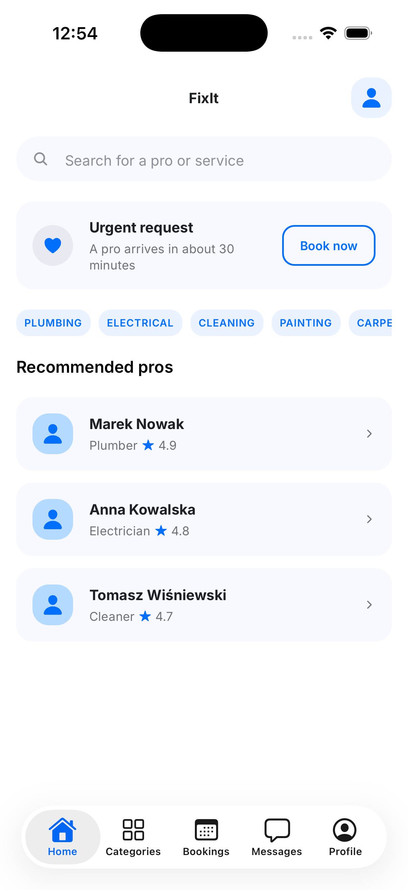
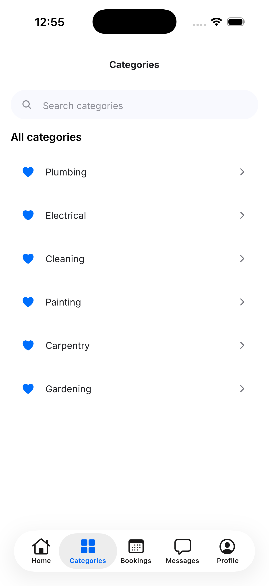

# FixIt — React Native Component Library

Cross-discipline assignment 3: turning the FixIt Figma design into real,
reusable React Native components with Expo + TypeScript.

FixIt is a mobile app that connects users with trusted local pros —
plumber, electrician, cleaner, painter, carpenter, gardener — for a
scheduled or urgent home-service booking.

**Figma:** [Shepeta_cross_assignments](https://www.figma.com/design/MJK386ryDWY8bcejg00axx/Shepeta_cross_assignments)

- Page **"01 — Wireframe"** — Assignment 1 (project description, Home,
  Categories, Pro Details, Checkout)
- Page **"02 — High-Fidelity UI"** — Assignment 2 (final colors, icons, the
  5-tab navigation structure this implementation follows)

## Screenshots

| Home                                      | Categories                                            | Pro profile                                             |
| ----------------------------------------- | ----------------------------------------------------- | ------------------------------------------------------- |
|  |  |  |

**Landscape / tablet** (content reflows into a 2-column grid past 600dp):

| Landscape                                       | Tablet                                    | Categories (tablet)                                        | Pro profile (tablet)                                         |
| ----------------------------------------------- | ----------------------------------------- | ---------------------------------------------------------- | ------------------------------------------------------------ |
|  |  |  |  |

**Native tab bar** on an iOS 26 simulator (real device build, not the web
preview above — see "Running the project"):

| Home                                                                            | Categories                                                                                  |
| ------------------------------------------------------------------------------- | ------------------------------------------------------------------------------------------- |
|  |  |

## Components

Each one lives in its own folder (`Component.tsx` + `index.ts`), styled with
`StyleSheet.create()` against shared theme tokens, and takes its content
through props — nothing is hardcoded per screen.

| Component      | Notes                                                                                   |
| -------------- | --------------------------------------------------------------------------------------- |
| `Button`       | primary/secondary variants, optional icon, loading state, optional `tintColor` override |
| `Header`       | back button + title + right slot, three independent floating Liquid Glass pieces        |
| `SearchBar`    | controlled `TextInput` with a search icon                                               |
| `Tag`          | selectable chip — category filters, time slots, optional trade icon                     |
| `CategoryList` | horizontal `FlatList` of `Tag`s                                                         |
| `ProCard`      | pro/review card — avatar, name, rating (the "product card")                             |
| `ListItem`     | generic row — category / pricing / summary lists, each with its own trade icon          |
| `TradeIcon`    | plumbing/electrical/cleaning/painting/carpentry/gardening pictograms, pulled from Figma |
| `StarRating`   | 0–5 rating, half-star aware                                                             |
| `Avatar`       | real photo via `Image`, Ionicons fallback when there's none                             |
| `GlassSurface` | Liquid Glass on iOS 26+, blurred elsewhere — shared by `Header` and the tab bar         |

Some notes on a few less obvious decisions:

- **`Pressable`, not `TouchableOpacity`**, for every tappable surface —
  `Pressable` is the current recommended component and is what
  `Button`/`ProCard`'s press states (`style={({ pressed }) => ...}`) actually
  need; `TouchableOpacity` doesn't support that.
- **The "Urgent request" card on Home uses its own accent color**
  (`colors.urgent` / `urgentLight`, `#FF5A3C` / `#FFE7E1`) instead of the
  brand blue used everywhere else — blue means "book calmly" throughout the
  rest of the app, so it shouldn't also mean "a pro arrives in 30 minutes."
- **Avatars use real (placeholder) photos**, not just an icon — `mockData.ts`
  points each pro/reviewer at a small illustrated avatar so `Image` actually
  renders content, not just a fallback glyph.
- **Category icons are real vector pictograms**, not a generic icon-font
  glyph reused six times — `TradeIcon` draws the actual plumbing/electrical/
  cleaning/painting/carpentry/gardening shapes from the Figma file, so each
  category chip and list row is visually distinct at a glance.
- **The second tab is labeled "Search"** even though the screen/route is
  still `Categories` internally — its first element is a search bar, so a
  magnifying-glass tab reads clearer than a generic grid icon would.

## Responsive layout

`useResponsiveLayout` (`src/hooks/useResponsiveLayout.ts`) uses
`useWindowDimensions` and reacts to **available width**, not device type — a
rotated phone gets the same treatment as a small tablet:

- **< 600dp** (phone portrait): content fills the screen, cards stack in a
  single column.
- **≥ 600dp** (tablet / landscape): the content column widens and repeating
  cards (`ProCard`, `ListItem`) reflow into a 2-column grid instead of
  stretching into one very wide row.

## Navigation & the tab bar

Screen transitions use `@react-navigation/native-stack` — tapping a
recommended pro on Home pushes the Pro profile screen with the platform's
native transition and swipe-back gesture.

The bottom tab bar is the **actual native tab bar widget**
(`react-native-bottom-tabs` + `@bottom-tabs/react-navigation`) —
`UITabBarController` on iOS, which picks up iOS 26's Liquid Glass
automatically, and Material 3 `BottomNavigation` on Android — rather than a
JS view styled to look like one. Icons are platform-native too: real SF
Symbols on iOS, rasterized Ionicons on Android (no SF Symbols equivalent
there).

**This needs a development build — it does not run in Expo Go**, and has no
web target (used only for quickly previewing layout during development, not
for the tab bar itself). See "Running the project" below.

## Liquid Glass

`GlassSurface` renders real Liquid Glass via `expo-glass-effect` on iOS 26+,
falling back to `expo-blur`'s `BlurView` everywhere else — same call site,
no branching needed at the usage site. `Header` uses it as three independent
floating pieces (back button, title, right slot) rather than one shared
background, matching how iOS nav bars typically separate these elements.

## Running the project

```bash
npm install
npm run ios         # or: npm run android — builds & installs a dev client
npm run ios:device  # same, with a device picker
npm start           # subsequent runs
npm run lint
npm run typecheck
npm run format
npm run web          # layout/component preview only — no native tab bar
```

**Important:** because of the native tab bar, this project needs a real
development build (`npm run ios` / `npm run android`), not Expo Go. Opening
it in Expo Go fails with `Unimplemented component: <RNCTabView>`, since that
native module isn't part of the standard Expo Go binary.

## Project structure

```
App.tsx
src/
  theme/        colors, typography, spacing, shadows
  components/    Avatar/ Button/ Tag/ StarRating/ Header/
                 SearchBar/ ListItem/ ProCard/ CategoryList/ GlassSurface/
                 TradeIcon/
  hooks/         useResponsiveLayout.ts
  navigation/    RootNavigator (native/web), tab bar + icon helpers
  screens/       HomeScreen, CategoriesScreen, ProDetailsScreen, PlaceholderScreen
  data/          mockData.ts
screenshots/
```

## What's not built yet

Out of scope for this assignment:

- `TextField`, `TextArea`, `Checkbox`, `WeeklyCalendar` and the
  Checkout/booking screen
- A real category-detail screen (`CategoriesScreen`'s rows are currently a
  no-op)
- Real data fetching (`data/mockData.ts` is static)
- Tests, form validation for the booking flow
