# FixIt — React Native Component Library

Cross-discipline assignment 3 turned the FixIt Figma design into real,
reusable React Native components with Expo + TypeScript. Cross-discipline
assignment 4 layered real navigation on top: a Drawer wrapping the tab bar,
and screens that actually pass and validate data between each other instead
of always showing the same hardcoded pro. Cross-discipline assignment 5 adds
a live API-backed directory: Home's Recommended pros and Categories' provider
lists both fetch real records over HTTPS, and tapping into either one shows
that person's own About/Pricing/Availability/Reviews profile — nothing here
reads from a hardcoded local list anymore.

FixIt is a mobile app that connects users with trusted local pros —
plumber, electrician, cleaner, painter, carpenter, gardener — for a
scheduled or urgent home-service booking.

**Figma:** [Shepeta_cross_assignments](https://www.figma.com/design/MJK386ryDWY8bcejg00axx/Shepeta_cross_assignments)

- Page **"01 — Wireframe"** — Assignment 1 (project description, Home,
  Categories, Pro Details, Checkout)
- Page **"02 — High-Fidelity UI"** — Assignment 2 (final colors, icons, the
  5-tab navigation structure this implementation follows)

## Screenshots

All taken on a real iOS 26 simulator build (`npm run ios`) — that's the
actual native tab bar and Liquid Glass chrome below, not a web mockup.

All screenshots below render at a fixed 260px width, so phone and tablet
shots line up evenly in the same grid regardless of their source resolution.

| Home                                                                | Categories                                                                      | Pro profile                                                                       |
| ------------------------------------------------------------------- | ------------------------------------------------------------------------------- | --------------------------------------------------------------------------------- |
| 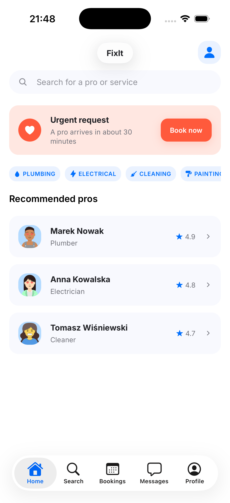 | 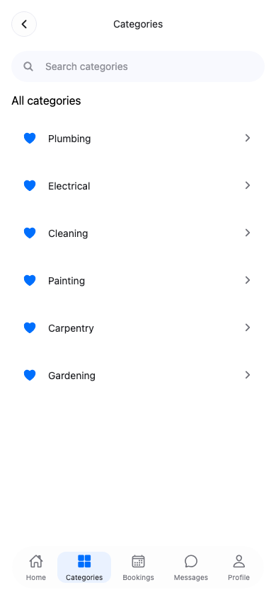 | 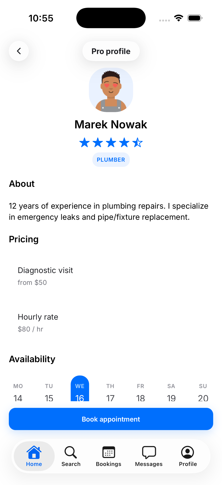 |

**Landscape / tablet** (content reflows into a 2-column grid past 600dp):

| Home (tablet)                                                            | Categories (tablet)                                                                  | Pro profile (tablet)                                                                   |
| ------------------------------------------------------------------------ | ------------------------------------------------------------------------------------ | -------------------------------------------------------------------------------------- |
| 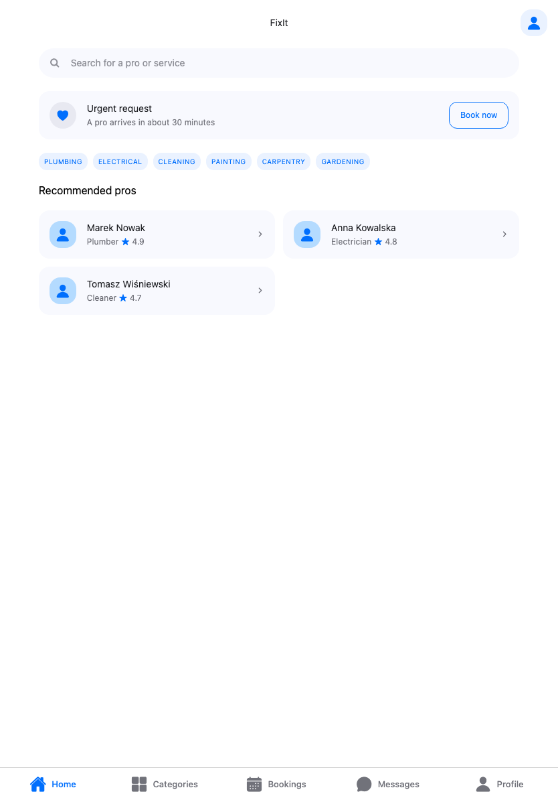 | 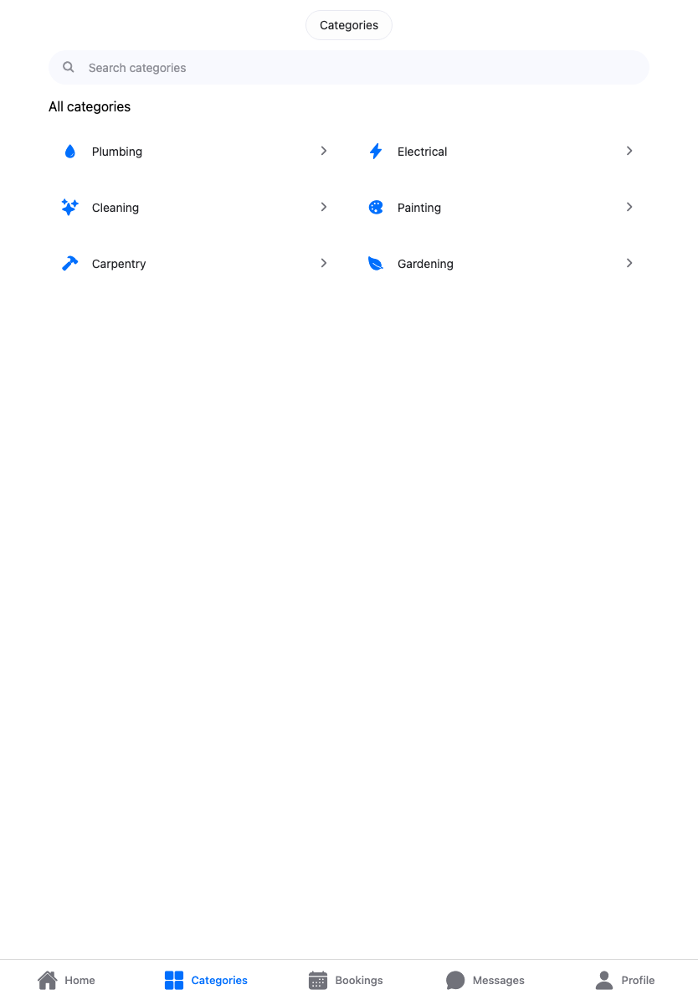 | 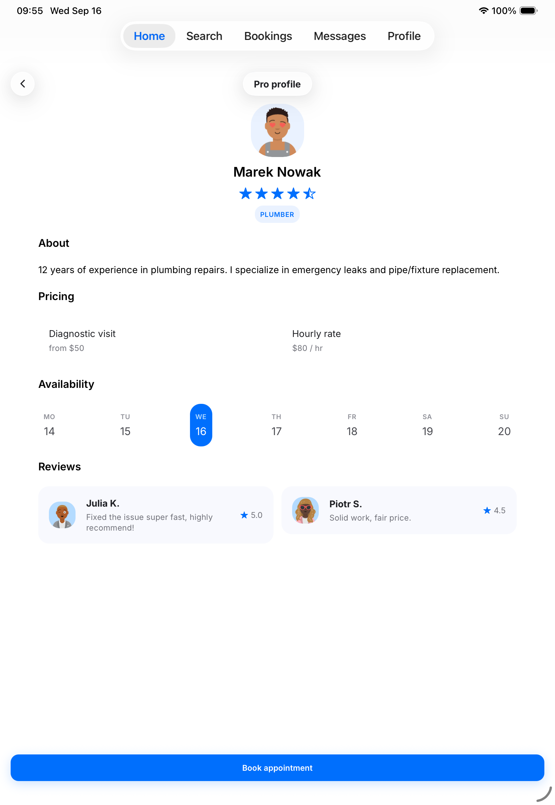 |

Home, landscape (wider than the grid above, so it gets the full width):

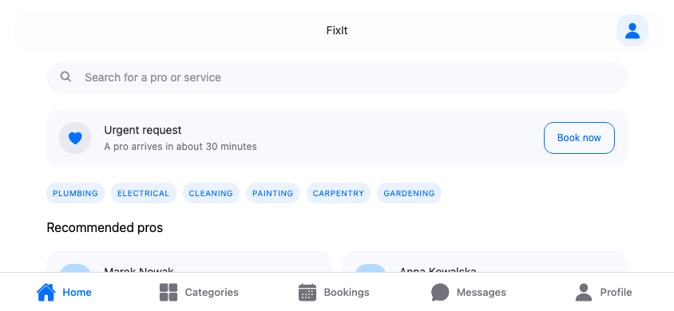

**Navigation** (Drawer menu, dynamic Pro profile, error handling — see
"Navigation" below): swipe from the edge or tap ☰ to open the Drawer; Help
& Support and Contact are Drawer-only screens with no tab bar of their own.

| Drawer open                                                                         | Help & Support                                                                      | Contact us                                                                                |
| ----------------------------------------------------------------------------------- | ----------------------------------------------------------------------------------- | ----------------------------------------------------------------------------------------- |
| 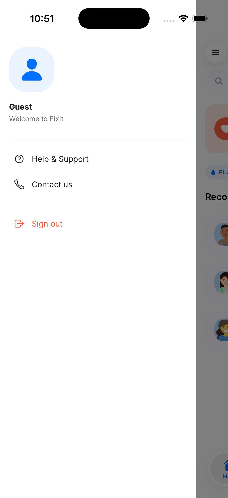 | 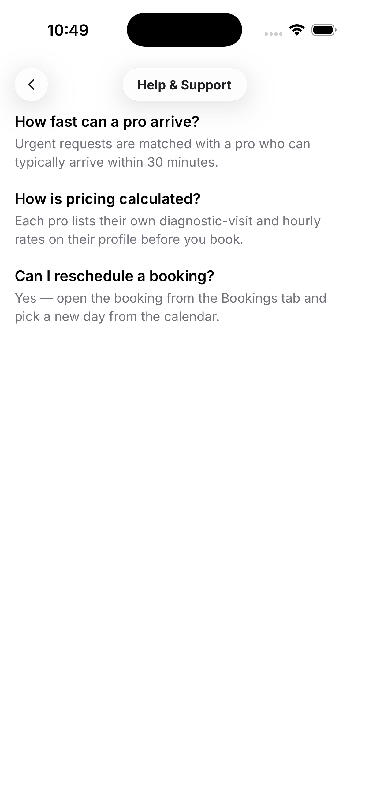 | 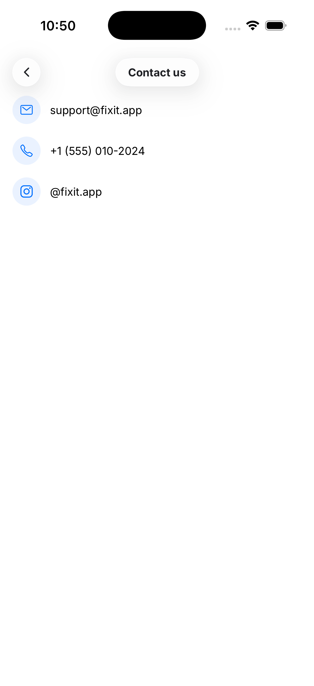 |

Sign out is an honest placeholder (there's no account in this app); tapping
a different pro shows that pro's own fetched About/Pricing/Reviews, not the
previous one's; and an invalid `proId` renders an explicit error state
instead of crashing:

| Sign out                                                                                  | A different pro                                                                                           | Pro not found                                                                           |
| ----------------------------------------------------------------------------------------- | --------------------------------------------------------------------------------------------------------- | --------------------------------------------------------------------------------------- |
| 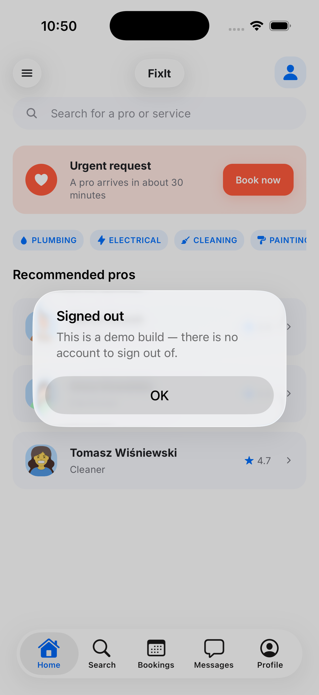 | 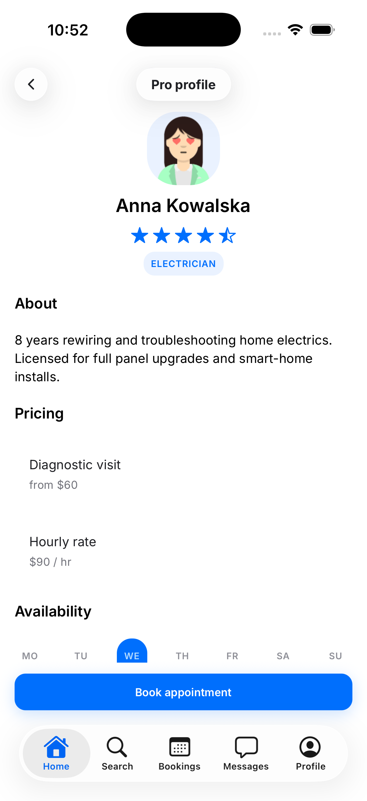 | 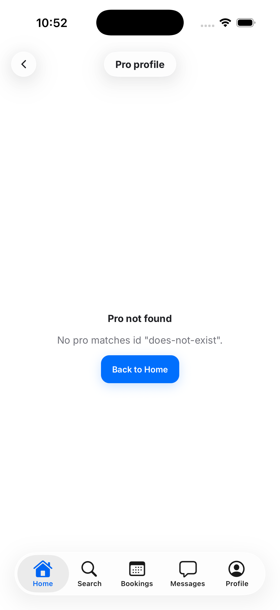 |

**Live API data** (a category's provider directory, fetched from a real
endpoint — see "Live data" below):

| Category provider list (phone)                                                            | Same list, 2-column on tablet                                                                            |
| ----------------------------------------------------------------------------------------- | -------------------------------------------------------------------------------------------------------- |
| 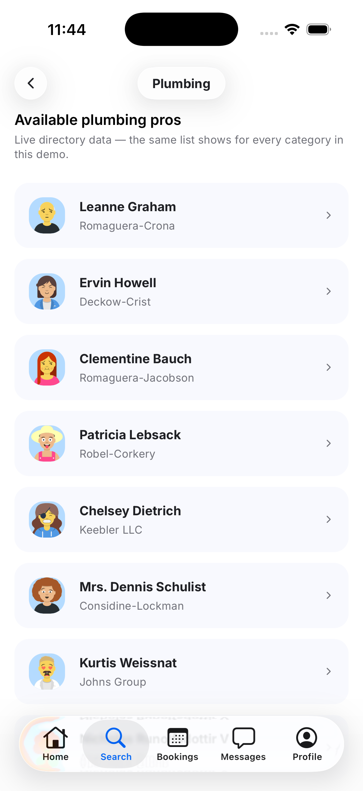 | 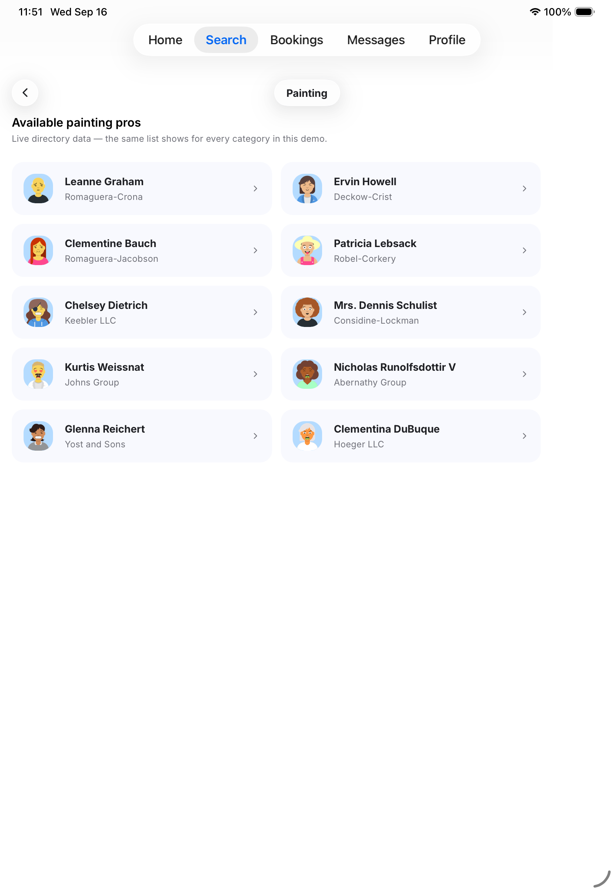 |

Tapping a provider fetches that one record and shows the same
About/Pricing/Availability/Reviews profile Home's Pro profile uses, and a
failed request renders an explicit error with a retry button, not a blank
screen or a crash:

| Provider details                                                                       | API error state                                                                  |
| -------------------------------------------------------------------------------------- | -------------------------------------------------------------------------------- |
| 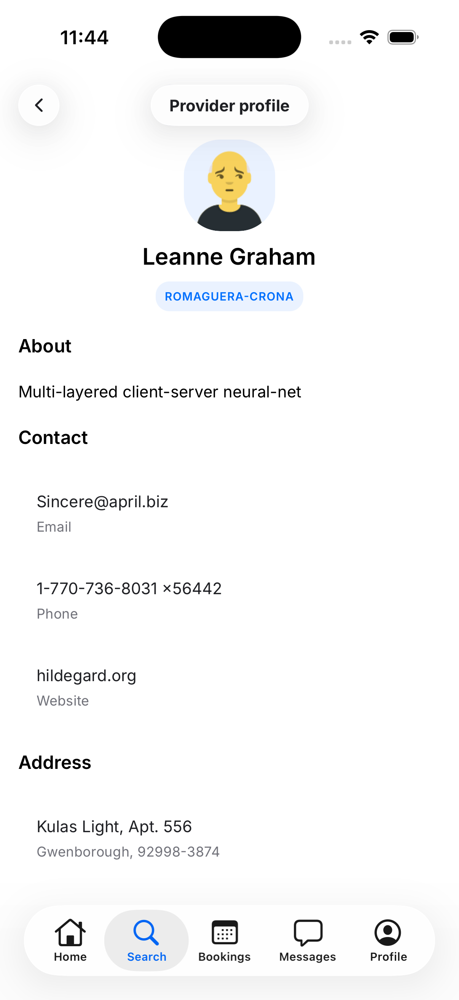 | 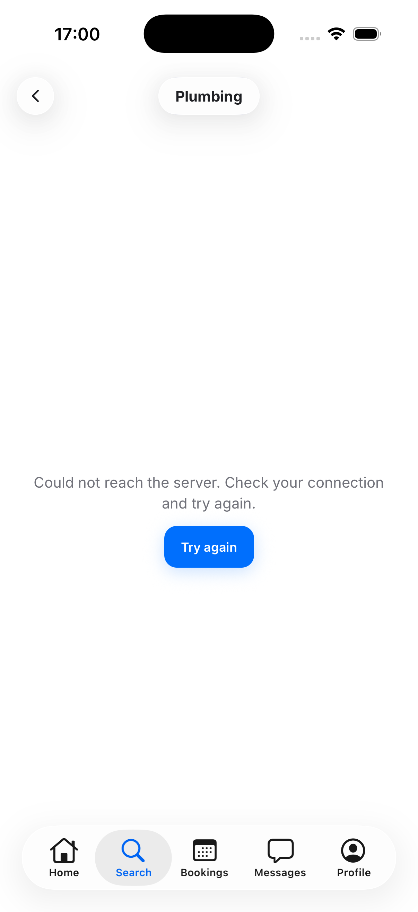 |

## Components

Each one lives in its own folder (`Component.tsx` + `index.ts`), styled with
`StyleSheet.create()` against shared theme tokens, and takes its content
through props — nothing is hardcoded per screen.

| Component      | Notes                                                                                   |
| -------------- | --------------------------------------------------------------------------------------- |
| `Button`       | primary/secondary variants, optional icon, loading state, optional `tintColor` override |
| `Header`       | back button + title + right slot, three independent floating Liquid Glass pieces        |
| `SearchBar`    | controlled `TextInput` with a search icon                                               |
| `Tag`          | selectable chip — category filters, time slots, optional trade icon                     |
| `CategoryList` | horizontal `FlatList` of `Tag`s                                                         |
| `ProCard`      | pro/review card — avatar, name, rating (the "product card")                             |
| `ListItem`     | generic row — category / pricing / summary lists, each with its own trade icon          |
| `TradeIcon`    | plumbing/electrical/cleaning/painting/carpentry/gardening pictograms, pulled from Figma |
| `StarRating`   | 0–5 rating, half-star aware                                                             |
| `Avatar`       | real photo via `Image`, Ionicons fallback when there's none                             |
| `GlassSurface` | Liquid Glass on iOS 26+, blurred elsewhere — shared by `Header` and the tab bar         |

Some notes on a few less obvious decisions:

- **`Pressable`, not `TouchableOpacity`**, for every tappable surface —
  `Pressable` is the current recommended component and is what
  `Button`/`ProCard`'s press states (`style={({ pressed }) => ...}`) actually
  need; `TouchableOpacity` doesn't support that.
- **The "Urgent request" card on Home uses its own accent color**
  (`colors.urgent` / `urgentLight`, `#FF5A3C` / `#FFE7E1`) instead of the
  brand blue used everywhere else — blue means "book calmly" throughout the
  rest of the app, so it shouldn't also mean "a pro arrives in 30 minutes."
- **Avatars use real photos**, not just an icon — every pro and reviewer
  comes from `src/api/providers.ts` with a real randomuser.me headshot, so
  `Image` actually renders content, not just a fallback glyph.
- **Category icons are real vector pictograms**, not a generic icon-font
  glyph reused six times — `TradeIcon` draws the actual plumbing/electrical/
  cleaning/painting/carpentry/gardening shapes from the Figma file, so each
  category chip and list row is visually distinct at a glance.
- **The second tab is labeled "Search"** even though the screen/route is
  still `Categories` internally — its first element is a search bar, so a
  magnifying-glass tab reads clearer than a generic grid icon would.

## Responsive layout

`useResponsiveLayout` (`src/hooks/useResponsiveLayout.ts`) uses
`useWindowDimensions` and reacts to **available width**, not device type — a
rotated phone gets the same treatment as a small tablet:

- **< 600dp** (phone portrait): content fills the screen, cards stack in a
  single column.
- **≥ 600dp** (tablet / landscape): the content column widens and repeating
  cards (`ProCard`, `ListItem`) reflow into a 2-column grid instead of
  stretching into one very wide row.

## Navigation

Three navigators, nested Drawer → Tab → Stack, each in its own file under
`src/navigation/`:

- **`RootNavigator.tsx`** — a `Drawer.Navigator` (`@react-navigation/drawer`)
  wrapping the whole app. `Main` is the 5-tab app below; `Help` and `Contact`
  are Drawer-only screens with no tab bar of their own. The Drawer's content
  is fully custom (`DrawerContent.tsx`) instead of the library's default
  list, so it matches the app's own colors/type/spacing. Swipe-from-the-left
  and the ☰ button on every root tab screen both open it.
- **`MainTabs.native.tsx`** / **`MainTabs.web.tsx`** — the 5 bottom tabs
  (Home, Search, Bookings, Messages, Profile). The bottom tab bar is the
  **actual native tab bar widget** (`react-native-bottom-tabs` +
  `@bottom-tabs/react-navigation`) — `UITabBarController` on iOS, which
  picks up iOS 26's Liquid Glass automatically (and its iPad-only top-bar
  layout — see `useTabBarLayout`), and Material 3 `BottomNavigation` on
  Android, rather than a JS view styled to look like one. Icons are
  platform-native too: real SF Symbols on iOS, rasterized Ionicons on
  Android. **This needs a development build — it does not run in Expo Go**,
  and has no web target (`MainTabs.web.tsx` is a plain JS bottom-tabs bar,
  used only to keep `npm run web` bundling for quick layout previews).
- **`HomeStackNavigator`** (inside `MainTabs.*.tsx`) — `@react-navigation/native-stack`,
  Home's own stack. Tapping a recommended pro pushes Pro profile with the
  platform's native transition and swipe-back gesture, passing
  `{ proId: pro.id }` through `navigation.navigate()`.
- **`CategoriesStackNavigator`** (inside `MainTabs.*.tsx`) — Categories' own
  stack: the category list, a fetched provider directory per category, and
  a single provider's own profile. See "Live data" below.

**Passing data between screens:** `ProDetailsScreen` reads `route.params.proId`
and fetches that one provider by id — it no longer just always renders Marek
Nowak. If `proId` is missing (a screen reached with no params) or doesn't
match any provider (a stale id), the screen renders an explicit error state
with a "Try again" button, instead of crashing on `pro.name`.

**Screen names are constants**, not scattered string literals — every
navigator and every `navigate()` call reads from `SCREENS` in
`src/navigation/screens.ts`.

**Gestures:** the Drawer's swipe-from-edge-to-open works on every root tab
screen (Home, Search, Bookings, Messages, Profile), and swipe-to-close works
while it's open. Screens with a back button (Pro profile, Provider profile,
Category details, Help, Contact) share that same left edge with
native-stack's own swipe-back gesture — with both enabled at once they fight
over the touch, so which one "won" depended on luck. `Header` now declares
which gesture should be active for the screen it's rendering through a small
context (`DrawerSwipeContext`, set from `RootNavigator`): a back button turns
the Drawer's swipe off, the hamburger menu turns it back on — since every
screen already has exactly one of the two, never both.

**Dependency note:** `react-native-gesture-handler` is pinned to `^3.3.0`
instead of Expo SDK 57's default `~2.32.0` (see `expo.install.exclude` in
`package.json`). The older version and `react-native-reanimated`'s new
Worklets runtime don't agree on how gesture callbacks cross the JS/UI-thread
boundary — every tap inside the Drawer threw a "tried to synchronously call
a Remote Function" error under 2.32.0. Bumping to 3.x fixed it outright.

## Live data

Both provider-facing screens are API-backed now, not just Categories': Home's
"Recommended pros" fetches the same directory Categories filters, and tapping
into a pro from either place — `ProDetailsScreen` (Home) or
`ProviderDetailsScreen` (Categories) — fetches that one record and renders it
through one shared `ProviderProfile` component, so both show the identical
About/Pricing/Availability/Reviews layout assignment 3/4 originally built
against local mock data.

- **`src/api/providers.ts`** — the only file that calls `fetch()`, per the
  assignment's "keep request logic in its own file" requirement. FixIt has
  no backend and no public API exists for "local home-service pros" to
  integrate against, so this hits
  [randomuser.me](https://randomuser.me), a free, no-key, HTTPS API built
  for exactly this kind of placeholder-person data — real-looking headshots
  and realistic names/location fields — behind `fetchProviders()` (the full
  directory, for Home), `fetchProvidersByCategory(categoryId)` (filtered, for
  Categories), and `fetchProviderById(id)` (a single record, for either
  detail screen), all sharing one `getProviders()` helper. `API_URL` is a
  constant, not inlined at every call site, and pins a fixed `seed` so the
  directory doesn't reshuffle on every reload.
- **Real GET requests, not axios** — plain `fetch`, matching the assignment's
  own example code; no reason to add a dependency for one endpoint.
- **`useAsyncData` (`src/hooks/useAsyncData.ts`)** — the fetch/`loading`/
  `error`/`retry` plumbing all four screens need, in one place instead of
  copy-pasted four times. Callers pass their own `useCallback`'d fetcher (so
  it only re-runs when e.g. an id from route params actually changes); the
  hook itself still uses plain `useState` internally — three independent
  values don't need `useReducer`'s ceremony.
- **A `View`-mapped grid on Home, `FlatList` on Categories** — Home's grid
  predates assignment 5 and still reflows into 2 columns via
  `useResponsiveLayout` the same way; `CategoryDetailsScreen`'s `FlatList`
  additionally sets `numColumns` directly and uses `keyExtractor: item =>
item.id` (randomuser.me's `login.uuid`).
- **Loading and errors are real states, not afterthoughts** — an
  `ActivityIndicator` while a request is in flight, and network failures
  (DNS, no connection) and non-2xx responses both render as an explicit
  message with a "Try again" button, never a blank screen.
- **Navigation stays wired the same way as assignment 4** — tapping a pro
  pushes its detail screen with `{ proId: item.id }` / `{ providerId: item.id
}`, which re-fetches by id rather than reusing the list response, the
  pattern a real per-record detail endpoint would need.
- **"Recommended" means top-rated** — Home filters the fetched directory down
  to providers rated 4.8★ and above (`RECOMMENDED_MIN_RATING` in
  `HomeScreen.tsx`), on top of the existing category-tag and search filters.
- **Honest about the API's limits:** randomuser.me is a person generator, not
  a directory of tradespeople — it has no category, job, rating, pricing, or
  review data at all, so all of that is FixIt's own, derived from the fetched
  data rather than invented independently of it:
  - each fetched person is assigned one of FixIt's 6 trade categories by
    their position in the (seeded, so stable) results array, round-robin —
    what makes the category filter genuinely different per category rather
    than cosmetic;
  - "About" is FixIt's own sentence built from the person's real age/city;
  - "Pricing" is a flat per-trade rate card, the same idea as the original
    mock data's hand-picked figures;
  - each "review" borrows two _other_ people from the same fetched batch as
    reviewers — their real name/photo, paired with one of two
    category-appropriate comments;
  - rating is a stable hash of the person's own uuid (4.3–5.0), so it's the
    same number on every reload instead of changing randomly.
    Likewise, randomuser.me has no per-record GET endpoint, so
    `fetchProviderById` re-issues the same seeded request and finds that one
    record client-side instead of hitting a true `/providers/:id` route —
    still a real, independent network round trip with its own loading/error
    state, just not a dedicated endpoint.

## Liquid Glass

`GlassSurface` renders real Liquid Glass via `expo-glass-effect` on iOS 26+,
falling back to `expo-blur`'s `BlurView` everywhere else — same call site,
no branching needed at the usage site. `Header` uses it as three independent
floating pieces (back button, title, right slot) rather than one shared
background, matching how iOS nav bars typically separate these elements.

## Running the project

```bash
npm install
npm run ios         # or: npm run android — builds & installs a dev client
npm run ios:device  # same, with a device picker
npm start           # subsequent runs
npm run lint
npm run typecheck
npm run format
npm run web          # layout/component preview only — no native tab bar
```

**Important:** because of the native tab bar, this project needs a real
development build (`npm run ios` / `npm run android`), not Expo Go. Opening
it in Expo Go fails with `Unimplemented component: <RNCTabView>`, since that
native module isn't part of the standard Expo Go binary.

## Project structure

```
App.tsx
src/
  theme/        colors, typography, spacing, shadows
  components/    Avatar/ Button/ Tag/ StarRating/ Header/
                 SearchBar/ ListItem/ ProCard/ CategoryList/ GlassSurface/
                 TradeIcon/ ProviderProfile/
  hooks/         useResponsiveLayout.ts, useAsyncData.ts
  navigation/    RootNavigator (Drawer), MainTabs (native/web), screens.ts,
                 DrawerContent, DrawerSwipeContext, tab bar height/icon helpers
  screens/       HomeScreen, CategoriesScreen, ProDetailsScreen,
                 CategoryDetailsScreen, ProviderDetailsScreen,
                 HelpScreen, ContactScreen, PlaceholderScreen
  data/          mockData.ts — categories, the Availability week, and the
                 PricingItem/Review types the API layer reuses
  api/           providers.ts — live randomuser.me-backed data (Home's
                 Recommended pros and Categories' provider directory)
screenshots/
```

## What's not built yet

Out of scope for this assignment:

- `TextField`, `TextArea`, `Checkbox` and the Checkout/booking screen
- A real Bookings/Messages/Profile — those tabs are placeholders
  (`PlaceholderScreen`), and Profile's own tabs (order history, settings)
  from the assignment brief's example aren't built
- "Book appointment" doesn't do anything yet — no booking flow exists to
  submit to
- Tests, form validation for the booking flow
